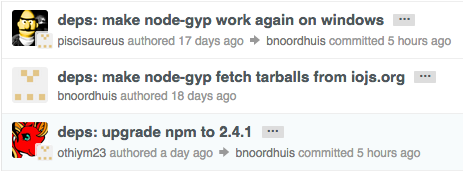

# Git Style Guide

Git style guide.
This is personally how I use git,
which is similar to the Express and the iojs teams' style.

## Anti-Patterns

### `Merge branch 'master' into branch 'master'`

If you ever see a commit that merges a branch into itself,
just run `git rebase` and it will clean itself up.

### `Merge branch 'master' into branch ...`

If you're merging a parent branch into a branch and see this commit, you merged wrong.
Type `git rebase master` (or whatever the master branch is) to get rid of this commit.

## Merging

### Avoid pressing the big green button

If possible, don't click the big green "Merge Pull Request" button.
Doing so creates a `Merge branch...` commit, which is noisy.

However, if you do this, you should always reference issues that
this commit solves in the commit title or description.

### Add the "committed by" message to each merge



- This is much cleaner than having commits that say "Merge Pull Request".
- All commits will be in the order in which they are committed.
  When you "merge" them, they are ordered by the date they are authored (technically no, but that's how it looks).
- It looks nice.

There are a couple of ways to add this:

- `git rebase` - only when you replay the commits, which is not always the case if the merged branch is already fast-forwarded.
- `git commit --amend`

### Amend the commits

So that they adhere to your styles:

- Any style changes.
- Change the commit message.
- Edit the commit description.
- Add any relevant links to the commit, such as links to the PR, issues, or information.
- Add a description.
- Add who else reviewed your commit.


### `git merge --squash`

When merging your own branch, you could use `git merge --squash` to squash all your commits.
I only say "merging your own branch" because doing so replaces the original author with you.
Thus, you are unable to properly assign blame.

### Rebase and merge

My personaly way of merging branches is the following:

Checkout the branch, rebase, and force push:

```bash
git checkout master
git pull

git checkout feature
# Maybe squash and amend
git rebase master
git push -f
```

If rebase does nothing, just do a `git commit --amend`.

The main reason is that you'd want the commits you merge to match the commits in the branch exactly.
This will tell GitHub to automatically close the pull request when you merge it like so:

```bash
git checkout master
git merge feature
git push
```

## Branching

### `git rebase master` all day every day

Don't diverge from your main branch as your problems will only exponentiate.

```bash
git rebase master
git push -f
```

### Squash frequently

Squash your commits frequently, but you should always squash it before merging.
You do not want or need your working commits (ex. a commit adding logs, another removing them)
in master as it's noisy and effectively negates itself.
Squash them out!

Another good reason to squash often is to make rebasing easy.
If you have a lot of commits, each commit is a potential merge conflict.
When you only have a single commit, you only need to do merge conflict resolution once!

### `git push -f` to only branches you own

Make sure you only push to the current branch!
There's a git config option for this, I don't remember what it was.
You do not want to overwrite shared branches unless everyone else knows!

## Committing

### Prefix the commit message with the submodule

For example, `readme: adding docs on stuff`.

### List which issues and PRs this commit solves

For example, `closes #56 closes #57`.
When the commit gets merged,
GitHub will know to automatically close these issues.
If you're working in a repository that is a fork or is expected to be a fork,
expand the issue like `closes jonathanong/git-style-guide#56`.

### Add emojis to your commit messages!

For example:

> deps: :arrow_up: koa@~0.16.0

Set a standard for your team.
Currently, I only do arrows for dependency changes.
It makes git way more fun!

## Creating Pull Requests

### Describe your pull request

Make sure the maintainer knows what's going on.

- What were the requirements and how were they satisfied?
- What is some potential technical debt?
- What would you like others to specifically review?
- Who would you like to review this PR? `/cc` them or assign them.
- Is this PR ready to merge or in progress?
- What issues does it close?

### Open your pull request early

Especially in teams where you want to know what others are working on.
It also helps to have others look at your progress so they make sure you're not
making any obvious mistakes and that you're on the right track.

### Don't change versions

Let the maintainer do the versioning.
The primary reason is that this commit could be included with other commits,
which may warrant a different version.
Thus, adding a commit that has a version in it makes everything more confusing.

### Rebase and Squash

Always rebase your pull request so that it can be cleanly merged.

Squash your commits appropriately - there should be as few as possible.
There should not be any working commits, ex.
commits where you add a log followed by another commit where they're removed.
There should not be any "merge" commits

## Merging Pull Requests

### Don't be pedantic

If the pull request needs some minor touch ups,
don't always bother asking the collaborator to fix every tiny detail.
Sometimes it's just easier to make those changes yourself, then squash the
commits so that they still have the credit.

For example, don't be so finicky with style changes
(you should lint in your CI testing service anyways)
or phrasing.
Just make those changes yourself.

### Don't be afraid to cherry-pick

If a pull request includes commits you are not interested in,
ex. version bump commits, then simply `cherry-pick` the commits
you're interested in. The collaborator will still get credit
and you don't have to bother asking the collaborator to "remove those commits".
